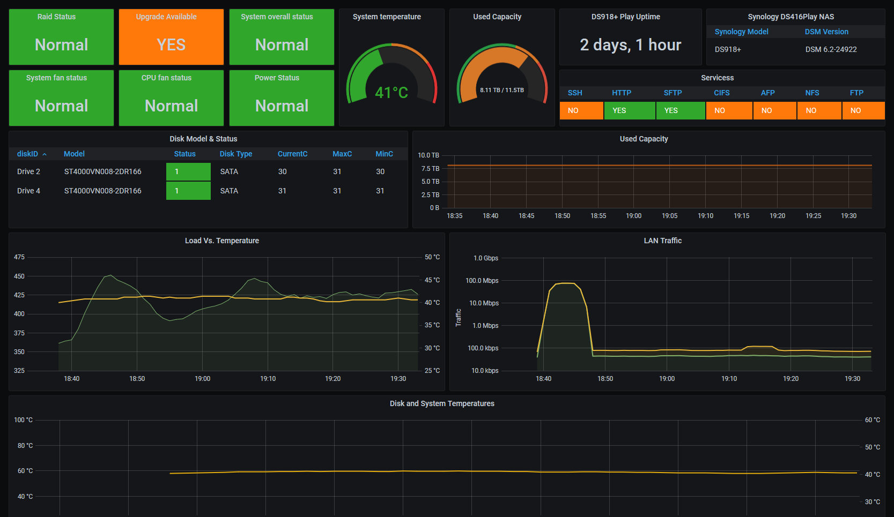

# Synology NAS monitoring 




* Make sure influxDB, Grafana, snmp, snpmd and telegraf is already installed on your host.
* edit /etc/snmp/snmp.conf and comment out the 'mibs:' line. Here is what mine looks like:

```
  GNU nano 2.7.4                                                                                                                   
File: /etc/snmp/snmp.conf
# As the snmp packages come without MIB files due to license reasons, loading
# of MIBs is disabled by default. If you added the MIBs you can reenable
# loading them by commenting out the following line.
# mibs :

```
* Get your MIBs (from here, for Synology [Synology MIB download](https://global.download.synology.com/download/Document/MIBGuide/Synology_MIB_File.zip)) and drop them in  below location:
```
user/share/snmp/mibs
```

* Now when you do a SNMPwalk, it will automatically translate OIDs to Names.

```
snmpwalk -c public -v 2c 192.168.X.X
```

* Update telegraf.conf with current on that attached in this repo, don't forget to update `agents = [  "192.168.X.X" ]`
* restart telegraf service.
* import Grafana dashboard.